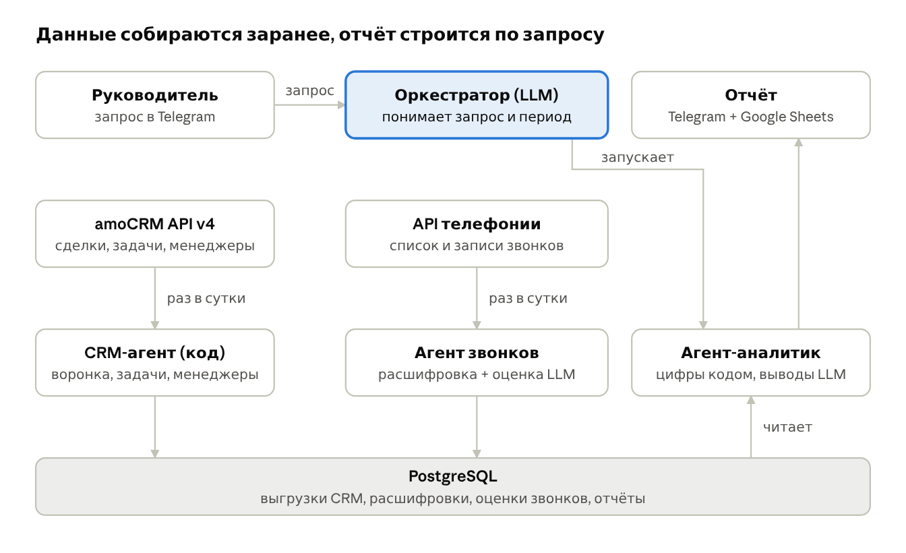

# Анализ работы отдела продаж: amoCRM + телефония

## 1. Архитектура



Главная идея: данные собираются заранее, раз в сутки, а по запросу руководителя только строится отчёт. Так отчёт приходит быстро и не упирается в лимиты API.

Второй принцип: все цифры (конверсии, количество сделок, просрочки) считает обычный код. Нейросеть я использую только там, где без неё никак: понять запрос, оценить разговор, написать выводы. Так меньше риск, что модель что-то придумает.

Агенты:

- **Оркестратор (LLM).** Получает запрос руководителя в Telegram, понимает период и что нужно, запускает аналитика и отправляет отчёт.
- **CRM-агент (код).** Раз в сутки забирает из amoCRM API v4 сделки (`/api/v4/leads`), задачи (`/api/v4/tasks`), менеджеров (`/api/v4/users`) и этапы воронки (`/api/v4/leads/pipelines`). Авторизация через OAuth 2.0.
- **Агент звонков (код + LLM).** Раз в сутки берёт из API телефонии список звонков и ссылки на записи (или примечания-звонки из сделок amoCRM), расшифровывает и оценивает.
- **Агент-аналитик (код + LLM).** Берёт данные из базы, считает метрики и пишет выводы.

Как обрабатываю звонки:

1. Получаю список звонков за период и привязываю каждый к сделке по номеру телефона.
2. Без всякой нейросети считаю: сколько звонков, сколько пропущенных, длительность, как быстро перезванивали.
3. Расшифровываю записи (Whisper или Яндекс SpeechKit). Звонки короче 20 секунд пропускаю, там обычно нечего анализировать, а расшифровка стоит денег.
4. Модель оценивает разговор по чек-листу: выяснил ли менеджер потребность, были ли возражения, договорились ли о следующем шаге. Ответ строго в JSON, код проверяет формат.

Хранение: PostgreSQL, в нём выгрузки из CRM, расшифровки, оценки звонков и готовые отчёты. Сами аудиофайлы не копирую, храню ссылки. Готовый отчёт уходит в Telegram и дублируется в Google Sheets. Для первой версии всё это можно собрать в n8n.

В отчёте: конверсия по этапам воронки, сделки и выручка по каждому менеджеру, сделки без задач и с просроченными задачами, пропущенные звонки, оценки звонков и 3-5 главных проблем со ссылками на конкретные сделки и звонки, чтобы руководитель мог сам проверить.

## 2. Что делает система, а что решает человек

Система только читает данные и показывает проблемы. Сама в amoCRM ничего не меняет.

Система делает сама:
- собирает данные из amoCRM и телефонии;
- считает метрики, находит сделки без задач и с просрочками;
- расшифровывает и оценивает звонки;
- пишет отчёт и рекомендации.

Передаёт человеку:
- любые решения по сотрудникам (премии, штрафы, обучение);
- спорные оценки звонков, плюс руководитель выборочно проверяет 5-10 оценок, чтобы понимать, можно ли им доверять;
- общение с клиентами;
- любые изменения в CRM.

Три главных риска:

1. **В CRM неполные данные.** Если менеджеры не ставят задачи и не двигают сделки по этапам, выводы будут неправильные. Поэтому в отчёте отдельно показываю, где данных не хватает.
2. **Ошибки расшифровки и выдумки модели.** Поэтому цифры считает код, модель отвечает по жёсткому чек-листу, а у каждого вывода есть ссылка на сделку или звонок.
3. **Персональные данные (152-ФЗ).** В записях звонков данные клиентов. Я бы использовал российские сервисы (Яндекс SpeechKit, YandexGPT, GigaChat) или модель на своём сервере и не передавал бы в модель телефоны и имена.

Ещё ограничение: amoCRM разрешает до 7 запросов в секунду, а расшифровка сотен звонков занимает время. Это ещё одна причина собирать данные заранее.

## 3. Код

Файл `amo_problem_deals.py`: находит в amoCRM активные сделки, у которых нет открытых задач или есть просроченные задачи.

Как работает: забираю все активные сделки (закрытые со статусами 142 и 143 отбрасываю), потом все незавершённые задачи по сделкам, раскладываю задачи по сделкам и проверяю каждую сделку.

```bash
pip install requests
export AMO_SUBDOMAIN=yourcompany
export AMO_TOKEN=долгосрочный_токен_интеграции
python amo_problem_deals.py
```

Проверял на тестовых данных, на реальном аккаунте не запускал. Для боевой версии добавил бы фильтр по воронке отдела продаж (`filter[pipeline_id]`) и повтор запроса при ошибке 429.

## 4. Мой AI-проект

Обработка заявок с нейросетью в n8n: https://github.com/m11sc/n8n-ai-requests

Задача: чтобы заявки клиентов разбирались автоматически (категория, срочность, краткое описание), а о срочных сразу приходило уведомление.

Стек: n8n, DeepSeek через OpenRouter API, JavaScript, Google Sheets API (сервисный аккаунт Google Cloud), Telegram Bot API.

Схема: форма -> нейросеть возвращает JSON -> код проверяет ответ -> запись в Google Sheets -> проверка срочности -> уведомление в Telegram.

Результат: заявка через несколько секунд уже в таблице в разобранном виде, о срочных приходит сообщение. Если модель ответит криво, заявка не теряется, а помечается "не распознано".

Проект сделан для портфолио и проверен на тестовых заявках, реальных пользователей у него пока нет. Ещё у меня есть Telegram-бот на Python, который каждый день сам пишет и публикует посты в канал через Groq API и GitHub Actions: https://github.com/m11sc/zen-bot

## 5. Чему научился за последние полгода

- **n8n, вебхуки, работа с LLM по API.** Применил в проекте с заявками.
- **Google Cloud и Google Sheets API.** Настроил сервисный аккаунт, чтобы сценарий писал в таблицу.
- **GitHub Actions.** Запускаю ботов по расписанию без своего сервера.
- **1С.** Прошёл бесплатный курс по программированию, сделал учебную конфигурацию для кофейни.
- **Godot.** Сделал мобильную игру "Связки" с рекламой Яндекса и отправил её в RuStore.

Учусь на практике: беру задачу и разбираюсь по документации, в работе пользуюсь ИИ-ассистентами.

## 6. Улучшение, которое я предложил сам

В армии (2025-2026) я отвечал за учёт допусков сотрудников подразделения. Учёт вели в Excel, но без формул: чтобы найти, у кого заканчивается допуск, приходилось вручную перебирать каждую строку, и сроки легко было пропустить.

Я предложил это автоматизировать и сделал: добавил формулы, сводные таблицы, фильтры и подсветку допусков, у которых истекает срок. Перебирать строки руками больше не нужно, руководство сразу видит актуальную сводку.

---

Михаил Чупин, Telegram @m11sc
